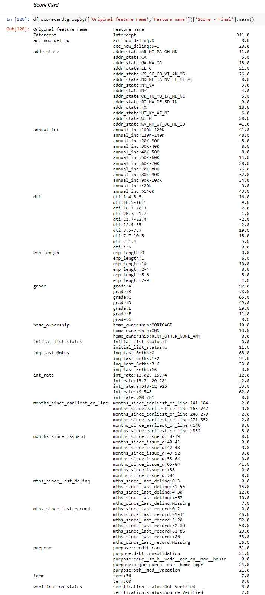

# Credit Risk Modeling using Machine Learning

## Aim:
This isn’t just another data project—it’s a blueprint for risk domination. We’re tearing through the dataset, uncovering insights that others overlook, and visualizing trends that redefine the game. Then, we bring in the heavy artillery: supervised machine learning models that don’t just predict risk—they call the shots.

We’re locking in:
🔥 Probability of Default (PD) – Spotting bad loans before they happen.
🔥 Loss Given Default (LGD) – Calculating how much is at stake before it’s too late.
🔥 Exposure at Default (EAD) – Knowing exactly how deep the risk goes.

This isn’t about predicting the future—it’s about owning it.

<pre>
├── data
│    ├── LCDataDictionary.xlsx (It contain list of all features of dataset)
│    ├── loan_data_2007_2014.csv (Main CSV File)
│    ├── loan_data_2007_2014_preprocessed.csv (File after preprocessing)
│    ├── df_scorecard.csv (It contain coefficient with score card)
├── Models
│    ├── PD Model (pd_model.sav)
│    ├── LGD
|         ├── lgd_model_stage_1.sav (Stage 1 model)
|         ├── lgd_model_stage_2.sav (Stage 2 model)
│    ├── EAD Model (reg_ead.sav)
├── Notebooks
│    ├── Step_1)EDA.ipynb (It contain EDA part)
│    ├── Step_2)Pre-Processing.ipynb (It contain basic preprocessing)
|    ├── Step_3) Pre-Processing for PD Model.ipynb (Preprocessing for PD model)
|    ├── Step_4) Modeling PD Model.ipynb (Modeling PD and Score card)
│    ├── Step_5) Preprocessing for LGD and EAD Models.ipynb (Preprocessing for LGD & EAG)
│    ├── Step_6) LGD and EAD Models.ipynb (Modeling LGD & EAD i.e training models)
│    ├── Step_7) Expected Loss.ipynb (Calculating expected loss)
</pre>

## Dataset:
We’re working with real financial firepower—a dataset packing over 800,000 consumer loans issued between 2007 and 2015 by Lending Club, a heavyweight in the US peer-to-peer lending game.

There’s more than one version of this dataset floating around, but here’s the deal: we cut through the noise, extract what matters, and turn raw numbers into strategic intelligence

## Models:
* For PD, I have used logistic regression
* For LGD, There is two stage approach. 1) Logistic Regression and 2) Linear Regression
* For EAD, I have trained linear regression

## Tools: pandas, scikit-learn, plotly, Flask
## Credit
I have gained all the knowledge through a course i.e https://www.udemy.com/course/credit-risk-modeling-in-python/
## Score Card (FICO Score 300-850):

